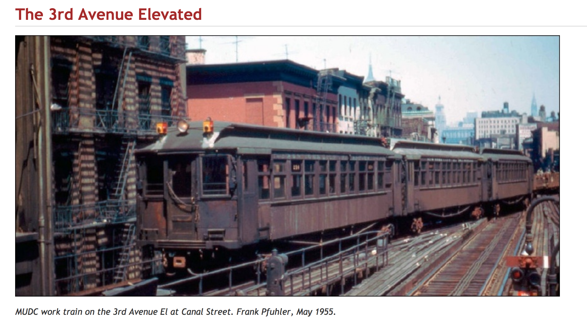
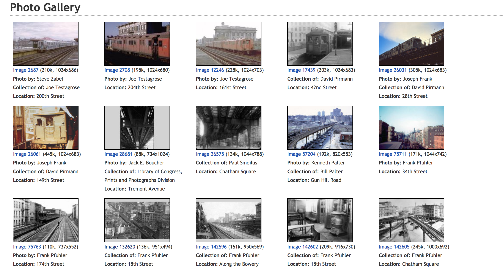

**The 3rd Avenue Elevated**

MUDC work train on the 3rd avenue El at Canal Street. Frank Pfuhler. May 1955

**Overview**

The 3rd Avenue Elevated line in Manhattan was constructed between 1875 and 1878 by the New York Elevated Railway Company. The lin was to run from City Hall along the Bowery and Third Avenue to the Harlem River. The Manhattan Railway

The 3rd Avenue Elevated line in Manhattan was constructed between 1875 and 1878 by the New York Elevated Railway Company. The line was to run from City Hall along the Bowery and Third Avenue to the Harlem River. The Manhattan Railway Company took control of the New York Elevated Railroad in 1879, and in 1891, the Manhattan Railway took over operations of a short railroad between 129th Street and 133rd Street in the southern Bronx, then operated by the Suburban Rapid Transit Company. Through service between the Bronx and Manhattan began in 1896. A 99-year lease deal made in 1902 brought the Third Avenue El under the control of the Interborough Rapid Transit Company.

Later construction under the Dual Contracts triple-tracked the main line of the elevated railroad in Manhattan and the Bronx. Originally operated by wooden elevated "gate" cars, these cars were later modified with closed-in vestibules and automatic doors and were known as the "MUDC" (Multiple Unit Door Control) fleet. In later years the 3rd Avenue line was operated by IRT "Composite" cars, retiring the MUDC fleet. Finally, after the 1940 transit unification, the 3rd Avenue el even saw BMT "Q" type cars running in Manhattan and the Bronx.
The Third Avenue El was the last elevated line to operate in Manhattan. Service to South Ferry ended in 1950, and to City Hall in 1953. The main line of the 3rd Avenue elevated in Manhattan had service from Chatham Square north until 1955. From 1955 to 1973 Bronx service operated between 149th St and Gun Hill Road.

**Track Maps**

The New York World, August 27, 1878
The east side branch of the New York Elevated Railroad
fulfilled part of the promise of rapid transit yesterday by beginning to run trains from the South Ferry to the Grand Central Depot in Forty-second street. All matters had been
thoroughly arranged before the first trip was made; the exact running time that the new engines could make was decided upon and a schedule had been carefully arranged. There
were but few stations, however, at which passengers were picked up and dropped. Those were at South Ferry, Hanover square, Fulton street, Eighth street and Forty-second
street. The first trip was made from South Ferry to Grand Central Depot at 5:30 A. M., and

the distance traveled in twenty-five minutes.
Areporter of THE WORLD road on a train that left South

Ferry about 1 P.M. This station is a common one for both branches, and many crowd in waiting started for the door when the agent called out “All passengers for the east side or
Third avenue.” There were two handsome cars on the train of maroon color, touched with gold and light paints, and glistening with varnish. The engine also was new and was
provided with a regular locomotive cab. The cars within were finished entirely in wood, the seats being of perforated pattern now so common, and running lengthwise of the car.
The roofs were slightly decorated, and there was an appearance of neatness without the attempt

at the elegance of the Metropolitan road.
While the reporter was examining the cars with a critical

eye the train was already far on its way through the narrow down-town streets. Through Pearl street it ran, making a deafening clatter with the rattle of the road itself, the
grinding of the wheels and the reverberations from the buildings. People in the street below, however, seemed to pay no attention to the engine and cars and the horses stood
quietly in front of their trucks and carts, without drivers near, and munched their fodder. In Third avenue the horses of the surface cars and of wagons jogged along, people looked
into shop windows and not to the sky, and the only difference was the train, having more room on each side, did not make so much

Noise

By this time, after one or two stops, the two cars were

comfortably filled, several of the passengers being women. The reporter, for lack of anything else to do, attempted to read the store signs, as he was rapidly carried along. Only
the big ones were readable. A woman knitting at a window was unpleasantly confounded with a man pressing hats, and a barber in the second story of a house, leisurely shaving a
customer, became by a sort of dissolving view arrangement a fat German woman energetically spanking a

child.
Cooper Institute suddenly loomed up -- a dark mass. There

was not much of the journey left after this, nor much novelty. There was the same round of women sitting at windows, sewing and occasionally half lazily looking at the cars that
shot past their houses; and of people quietly walking along the streets, until the train turned to Forty-second street, frightened a team of horses attached to a brewer's dray and
then halted at the Grand Central

Depot.
As the reporter passed out of the car he said to one of the conductors:
“Were you connected with the west-side road?"

"Yes," answered the man.

“Have you noticed any difference between the noise of the two roads?”

“| should think | have.”

“Which fs the worst?"

“This.”

It is certain that a horrible shriek and squeak of metal

on metal, as if the cars were dragged over the track with brakes down, is sometimes to be heard on the east side and strange to the
west.

The construction of the east side branch of the New York

Elevated road was begun about the 1st of last November, under contracts with the New Jersey Iron and Steel Company, the Passaic Rolling Mill Company. J. B. & J. N. Cornell and
A. R. Whitney Brother, the railroad company furnishing the plans and specifications. There are two different kinds of structure on the new road. The longitudinal girders and
columns are substantially the same on both branches, but on Front and Pearl streets, as far as Franklin square, the columns are straight up to the cross girders. The remainder are
curved. On Third avenue, above Fifth street, the two tracks are connected by arched girders. Mr. Walter Katte, the chief engineer of the road, said yesterday that he thought the
road would be finished to Sixty-first street about October 1st and to Harlem before the 1st of

January.
Each car will accommodate forty-eight persons.
The engines are all of the same kind, excepting that some

have four wheels and others eight. Both will be tried until it is found which will answer best. Many new men have been taken on and the entire force has been divided between the
‘two branches, so that there will be an old hand on each train running on the east side. The trains will run at ten-minute intervals between 5:30 and 6: A.M., five minutes between
6 and 10 A. M., six minutes between 10 A. M. and 3 P. M., five minutes between 3 and 7:30 P. M., and ten minutes between 7:30 and 8 P. M., when the line will be closed.
Between the hours of 5 and 7:30 A. M. and 5 and 7 P. M. the fare will be 5 cents; at other times, 10 cents. The running time for the trip will be twenty-five

minutes until the engines and cars are broken in.

The following answers about the noise on the road were collected by the Post reporter:

At Lamke Brothers’, grocers, No. 103 Third avenue: "Naw, we are used to noises on this avenue.”

At Charles Eitenbenz’s boot and shoe shop, No. 89 Third avenue: "No, in about a week we don't hear it no more.”

At Meyerholz & Blum’s florists, No. 77 Third avenue

No, we ain't got no time to notice it.”

At George P. Lies's cigar store, No. 59 Third avenue: "No, it doesn’t make as much noise as Sixth avenue.”
‘At George W. Hamill’s, undertaker, No. 26 Third avenue:

“No, you listen now: it’s not as loud as that

street-car.”

